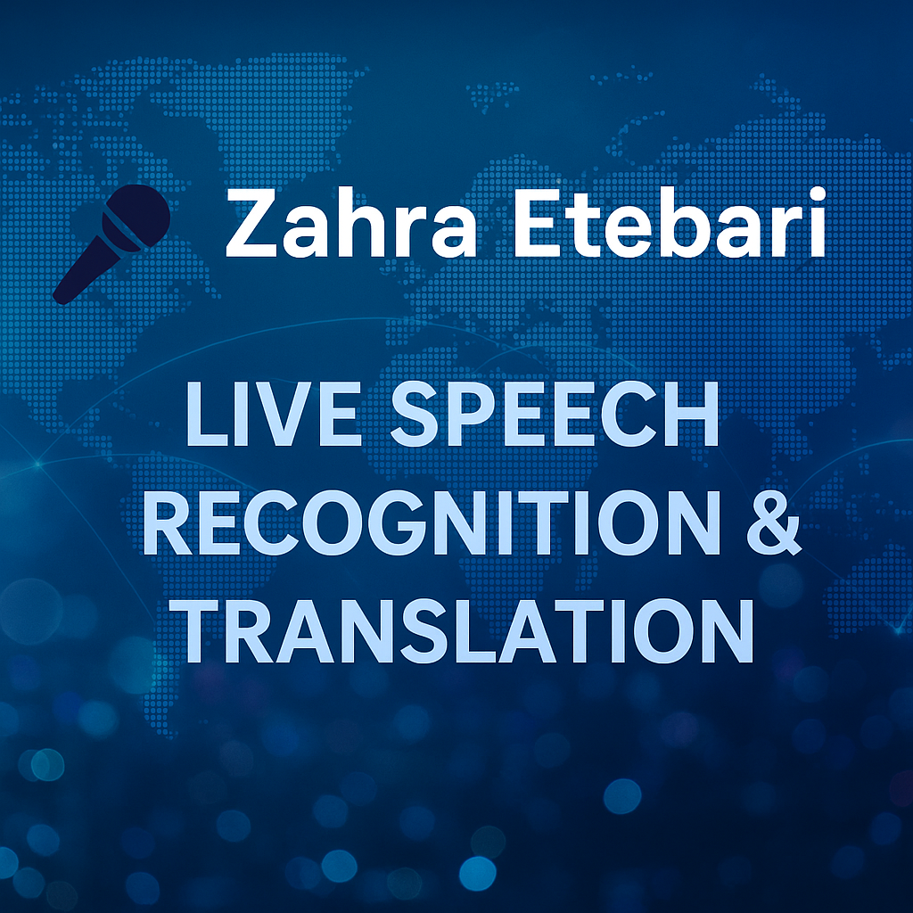

#  Speech Recognition & Translator


A Progressive Web App for real-time speech-to-text with instant translation to 20+ languages.

##  [**Try Live Demo →**](https://live-speech-translation.netlify.app/)


##  Features

-  **Real-time Speech Recognition** - Instant speech-to-text
-  **20+ Languages** - Speak and translate instantly
-  **Audio Visualization** - Live waveform display
-  **Download Transcripts** - Save as text files
-  **Progressive Web App** - Install on any device
-  **Privacy-First** - All processing in your browser

##  Technologies

- Web Speech API
- Google Translate API
- Progressive Web App (PWA)
- Web Audio API
- Vanilla JavaScript
- Modern CSS3

##  Supported Languages

**Input:** English, Spanish, French, German, Italian, Portuguese, Japanese, Chinese, Hindi, Arabic, Russian, Korean, Dutch, Turkish

**Translation:** All above + Vietnamese, Thai, Polish, Swedish, Norwegian, Danish, Finnish

##  Use Cases

- Language learning
- International meetings
- Accessibility tool
- Live interpretation
- Transcription service

##  How to Use

1. Visit the [live demo](https://live-speech-translation.netlify.app/)
2. Select your input language
3. Select target translation language
4. Click "Start Recognition"
5. Allow microphone access
6. Start speaking!

##  Technical Highlights

- Real-time audio processing
- Debounced API calls for optimization
- Responsive cross-platform design
- Offline-capable PWA
- Zero server costs

##  Author

**Zahra Etebari**
- Portfolio: github.com/Zahra58 
- LinkedIn:  www.linkedin.com/in/zahra-etebari 
- GitHub: github.com/Zahra58 

---

⭐ **Star this repo if you find it useful!**

 **Live Demo:** https://speech-translator-app.netlify.app
```


- Implemented offline-capable Progressive Web App
- Deployed with automated CI/CD via Netlify
- Tech: JavaScript ES6+, Web APIs, PWA, Git
